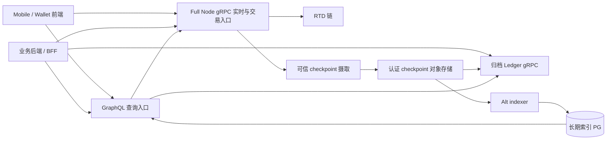

# RTD 数据服务拓扑与历史保留方案

> 调研时间：2026-09-24（中国标准时间）。本文只审计源码、配置与本机只读状态；没有启动、停止或修改链与索引服务。源码路径均相对 `/Users/changzechuan/WenchuanProjects/RTD-Blockchain`。Sui 官方文档中的 `sui` 在架构判断上对应 RTD；**官方 Sui 公共端点、服务启用时间与现有 RTD 部署状态不能直接等同**。

## 1. 结论与边界

RTD 的正确生产拓扑是 **Full Node gRPC 承担最新链状态、交易执行与模拟；可长期保留历史的索引库承担筛选和分页；独立归档 Ledger gRPC 承担已修剪交易、检查点、对象版本的点查；GraphQL 在前端一侧组合这些数据源**。索引器可以替代 Full Node 的部分**读取**，不能替代它的执行、模拟、实时同步和权威最新状态。GraphQL 可以提供交易提交接口，但它在服务器侧仍把该请求送到 Full Node。依据见 [Sui 官方迁移指南](https://docs.sui.io/develop/accessing-data/json-rpc-migration)、[GraphQL 架构说明](https://docs.sui.io/develop/accessing-data/graphql/graphql-rpc)及本地实现 [E1]、[E6]、[E7]。

**不能把“索引器已经归档 checkpoint”理解成“历史细节已经有 GraphQL 或 gRPC 接口”。** 当前 `rtd-indexer` 项目已经有 PostgreSQL、S3/MinIO checkpoint 归档、Alt 索引以及只读历史 JSON-RPC；尚未把新版 `temp/rtd` 的 GraphQL 服务或 Bigtable 归档 Ledger gRPC 纳入其本地/Kubernetes 部署。新版 GraphQL 的交易、对象、检查点点查甚至要求配置一个 `--ledger-grpc-url`，索引 PostgreSQL 并不是该版本的默认点查替身 [E6][E8][E11]。

### 数据类型到责任方

| 需求                                                                | 首选数据面                                                                                    | 为什么                                                       | Full Node 断源或历史超出保留时                                                                |
| ------------------------------------------------------------------- | --------------------------------------------------------------------------------------------- | ------------------------------------------------------------ | --------------------------------------------------------------------------------------------- |
| 签名交易提交、模拟、当前 gas/余额、当前持有对象                     | Full Node gRPC；对外也可经配置了 Full Node 的 GraphQL                                         | 状态必须紧贴链头，执行需要节点的交易编排器                   | 交易执行/模拟不可由只读索引器补上；当前状态不能用落后索引水位冒充。                           |
| 已知 digest 的交易和事件、已知序号的 checkpoint、已知 ID+版本的对象 | 最近数据：Full Node `LedgerService`；旧数据：独立归档 `LedgerService`                         | 相同 protobuf 服务便于显式选源，但 Full Node 有保留窗口      | 按已核验的覆盖范围切到归档 gRPC；现阶段只能在旧版原生历史 JSON-RPC 已索引范围内暂用兼容路径。 |
| 某地址交易、某类型事件、对象版本列表、跨资源聚合、分页              | Alt PostgreSQL + GraphQL                                                                      | 索引能按字段筛选、连接多种实体；归档点查并不生成任意过滤索引 | 保留相应索引表与水位；超出 PG 保留范围时必须有另一个长期查询索引或明确产品查询期限。          |
| 连续 checkpoint 摄取、低延迟事件流                                  | Full Node gRPC `SubscriptionService`；补历史使用 `LedgerService.List*` 或可信 checkpoint 归档 | 实时流与历史扫描是不同的数据源和恢复语义                     | 断源时只能读已归档区间，不能声称继续产生新链头。                                              |

Sui 官方明确将 Full Node gRPC 定位于实时数据和执行，将 GraphQL 定位于前端、跨资源和历史筛选；Full Node gRPC **没有旧 JSON-RPC 的隐式历史归档回退**，旧数据通常返回 `NOT_FOUND`。[官方选择与映射](https://docs.sui.io/develop/accessing-data/json-rpc-migration)、[官方归档查询](https://docs.sui.io/develop/accessing-data/archival-store/using-archival-store)。本地 `GetTransaction` 与 `GetCheckpoint` 也实际比较最低可用 checkpoint，越界直接报未找到 [E2][E3]。

## 2. Full Node 实际提供什么

`temp/rtd` 的 Full Node HTTP RPC 服务把 JSON-RPC、gRPC、REST 挂在同一 `json-rpc-address` 监听地址；`network-address` 的默认 8080 是节点网络地址，**不是面向应用的 gRPC 入口**。默认 `json-rpc-address` 是 9000，但实际部署可改。`disable-json-rpc` 只关闭 JSON-RPC 路由，不停止同端口的 gRPC/REST，也不自动停止旧 JSON-RPC 索引处理 [E1]。因此迁移时不能把“关掉 JSON-RPC”写成“关掉 9000 端口”，也不能把索引处理和 JSON-RPC HTTP 路由混为一谈。

Full Node 的 gRPC 包含 `LedgerService`、`StateService`、`TransactionExecutionService`、订阅、包与签名相关服务；交易执行由其交易编排器注入，订阅由服务构建，底层支持 gRPC-Web 层 [E1][E4]。`rtd-apis` protobuf 定义的 `LedgerService` 提供 `GetObject/GetTransaction/GetCheckpoint`、批量、`ListCheckpoints/ListTransactions/ListEvents`；`StateService` 提供余额与拥有对象；执行服务提供执行与模拟 [E5]。客户端能否直接使用每个方法还应按所部署二进制、服务配置、协议版本和访问网关验证，不能只由 proto 推断可用。

### 修剪与“历史不存在”的语义

节点对象保留 `num-epochs-to-retain`、checkpoint/交易效果保留 `num-epochs-to-retain-for-checkpoints`、旧 JSON-RPC 索引保留 `num-epochs-to-retain-for-indexes` 是**不同开关**。源码默认对象值为 `0`（注释称激进修剪、实验模式），checkpoint 与索引两个可选项默认为 `None`；示例 Full Node YAML 把对象改成 1 个 epoch，且未给归档读取地址 [E9]。因此不能写“Full Node 默认保留 30 天”或由示例 YAML 推算现网窗口。即使 checkpoint 内容仍在，本地 `get_lowest_available_checkpoint()` 取 checkpoint 与对象最低可用水位中的较大值，交易/检查点 gRPC 会以此拒绝更旧的请求 [E2][E3]。

`GetObject` 的版本参数会读指定对象版本；旧版本被对象修剪后返回未找到 [E2]。`GetTransaction` 先取得交易所属 checkpoint，再检查服务可用下界，越界后同样返回未找到；仅看到 `NOT_FOUND` 不能推断交易从未发生。调用方应核对本链身份、所请求的 checkpoint/digest 是否在索引或归档覆盖区间，以及归档端点的水位；对确证存在或有覆盖证明的旧数据做显式归档点查。Sui 官方也特别说明 Full Node gRPC 不会代替客户端查归档。[官方迁移须知](https://docs.sui.io/develop/accessing-data/json-rpc-migration)、[归档服务](https://docs.sui.io/develop/accessing-data/archival-store/what-is-archival-store)。

把 Full Node 永久配置成完全不修剪，可在短期缓解旧数据点查，但会把对象/交易/索引增长压力转移到共识同步与服务节点，不能代替独立的归档/查询层。历史服务必须在修剪前完成连续摄取、认证、持久化和可读取验收。

## 3. 本地两代源码与当前索引服务的真实关系

这里有两个时间点不同的 RTD fork，不应混写：

1. `rtd-indexer/fork-sources.json` 固定 `../rtd` 的某个提交，构建脚本只生成 `rtd-indexer-alt` 与 `rtd-indexer-alt-jsonrpc` 两个原生二进制 [E10]。该**旧版** Alt JSON-RPC 的 KV 点查在未配置 Bigtable 时直接使用 PostgreSQL；能返回已索引的历史交易和对象版本 [E11]。它不等于新版 `temp/rtd` 的 GraphQL 或 Ledger gRPC。
2. `temp/rtd` 的**新版** Alt GraphQL 要求 PostgreSQL 提供筛选/分页索引，另以 `--ledger-grpc-url` 取得交易、检查点、对象版本点查；没有该 URL，当前 `start_rpc` 报错，不能仅带 PG 启动 [E6][E7]。`Query.transactions` 根据 PG 索引找序号，而交易内容会交给 `KvLoader` / Ledger gRPC，因此“列表能找到摘要”并不保证“详情能打开” [E7]。`--fullnode-rpc-url` 单独负责执行/模拟；未配置时这些 resolver 返回功能不可用。GraphQL 可选 Consistent Store 负责最近 checkpoint 的活对象/余额视图 [E6]。
3. `temp/rtd` 已有 `rtd-kv-rpc` 代码，用 Bigtable 作为后端提供 `LedgerService` 点查，并在启用和准备好所需流水线时提供三个 List API；其注册的是 Ledger 与 MovePackage 服务，没有 `StateService` 或 `TransactionExecutionService` [E12]。**有源码和 Dockerfile，不代表 RTD 已有可用 Bigtable 数据、部署、网络地址或经过端到端验收的归档端点。**

Sui 当前官方 GraphQL 概述说：GraphQL 可从 PG、Archival、Consistent Store 和 Full Node 读取，在一些官方版本中没有归档时可回退 PG。[官方 GraphQL 架构](https://docs.sui.io/develop/accessing-data/graphql/graphql-rpc)。这描述的是官方服务能力，不应覆盖本项目当前 `temp/rtd` 实际的 `--ledger-grpc-url` 强制要求。迁移工程以**所部署 RTD 二进制与源码版本**为准；若计划采用官方所述 PG 回退，应先在 RTD fork 实现/验证该路径，而不是写进前端承诺。

### `rtd-indexer` 已实现的历史能力

`rtd-indexer` 归档 worker 用可信 genesis、Full Node gRPC、指定的目录或 HTTP 归档源获取完整 checkpoint，并把认证结果持久写入私有 S3/MinIO；checkpoint gateway 只对已认证且在连续覆盖内的归档文件放行 [E13]。Native writer 从 gateway 摄取并写 Alt PG；显式 `indexer.toml` 配置 21 条 pipeline，**没有逐 pipeline pruner**，不同于自动生成的示例配置 [E14]。它有助于保留历史筛选数据，但依赖源最早可读 checkpoint；早期缺口不能凭空恢复。

现有 29102 `native-rpc` 是基于旧 Alt PG 的**只读历史 JSON-RPC**，不配置 Full Node 执行地址，因此无法执行交易 [E15]。29106 `query-rpc` 是针对旧版 Full Node 的 45 项只读 JSON-RPC 合同转发；Full Node 不可达时只有 2 项链标识能独立返回，4 项历史接口在严格条件下回退，其余 39 项仍需 Full Node。它不能作为通用 Full Node、GraphQL 或 gRPC 的替代品 [E16]。特别是 `rtd_getTransactionBlock` 的历史详情没有在 29106 做离线同名等价回退；旧 PG 的 29102 有自己的历史查询能力，两者接口和可用性不能合并报告。29106 `/readyz` 还会在 Full Node 断源时返回 503，Kubernetes 会摘除该服务，即便代码中个别回退可直连 [E16]。

### 2026-09-24 00:34 本机只读快照

执行了 `rtd-indexer/localDeploy/rtd-indexer.sh status all`、监听端口检查和健康探测，没有启动/停止服务：

- `temp/rtd/target/debug/rtd` 的 Full Node 进程监听本机 9000，`/health` 返回 200；这仅证实 Full Node HTTP 服务存活，未验证所有 gRPC 方法和历史覆盖。当前 9000 JSON-RPC 对 `rtd_getFullChainIdentifier` 返回 `-32601 Method not found`，而该方法仍被旧版 29106 的上游身份检查调用 [E16][E17]。当前 `rtd_getChainIdentifier` 返回 `1a5a3925`。
- PostgreSQL、MinIO、archive-worker、gateway、control-api、web-admin 在各自健康检查下运行；**native-writer 与 native-rpc 停止**，29106 进程在运行但 `/readyz` 返回 503。状态报告 `NETWORK_MISMATCH`、`lastErrorCode=NETWORK_MISMATCH`，归档与索引持久水位均为 245317，下一项 245318；它不表示现在仍在追链。索引库绑定的旧网络 ID 是 `5MB6…fwt`，其短 ID 为 `4099c63d`，与当前节点的 `1a5a3925` 不同。旧链归档与当前链须严格隔离，不能为让服务变绿而修改绑定身份或跳过缺口。
- 7000 端口属于系统 `ControlCenter`，不是 RTD GraphQL。`rtd-indexer` 端口/部署清单没有 GraphQL、`rtd-kv-rpc` 或归档 Ledger gRPC 服务，故本机不能宣称它们已部署 [E18]。此外，旧 29106 合同面向旧版 `rtd`，新版 `temp/rtd` 已删掉 `rtd_getFullChainIdentifier`，所以即使切到同链，仍需升级合同/身份探测并逐方法核对语义，不能直接复用旧 45 项覆盖结论 [E17]。

本节是一个时间点的快照；后续部署状态、水位、链身份必须实时重新读取。`ready` 只表示局部进程条件满足，不是历史覆盖验收 [E13][E16]。

## 4. 历史查询应由谁承担

### 4.1 已知键的点查

生产上由**归档 Ledger gRPC 服务**承担已修剪交易详情、checkpoint 详情与旧对象版本；它应暴露与 Full Node 相同的 `LedgerService.GetTransaction/GetCheckpoint/GetObject`（以及实际实现的批量接口），并由客户端或 GraphQL 服务明确选用。官方 Archival Service 的职责正是这些点查，并不代理执行/模拟或当前余额 [官方迁移指南](https://docs.sui.io/develop/accessing-data/json-rpc-migration)、[官方归档概念](https://docs.sui.io/develop/accessing-data/archival-store/what-is-archival-store)。

RTD 可选两条**需要建设与验收**的落地路：

- **采用现有 `rtd-kv-rpc` 路线**：运行与其匹配的 Bigtable/kvstore 摄取流水线，验证从 genesis 至链头的对象版本、交易、checkpoint 完整度与 Ledger gRPC 合同，再给 GraphQL 的 `--ledger-grpc-url`。当前 `rtd-indexer` 的 PG+S3 不会自动变成 Bigtable 数据 [E12][E18]。
- **利用现有 PG+S3 归档建设 Ledger 适配服务**：以旧 Alt PG 的 `kv_*` 数据和认证 checkpoint 为来源，实现 Ledger protobuf 点查、FieldMask、批量、错误语义、最低/最高覆盖水位、链身份校验与读写权限隔离；必要时从 checkpoint 归档解码补全对象和事件。此适配器在当前仓库里**尚未实现**，不能把 29102 的 JSON-RPC URL 填进 `--ledger-grpc-url`。如果要让一个 URL 同时提供最近和旧数据，还需实现并测试显式热/冷路由；当前 `temp/rtd` GraphQL 只接收单个 Ledger gRPC URL [E6]。

过渡期间可以由可信服务端/BFF 仅对已验证覆盖的历史点查调用 29102；这只是 JSON-RPC 退场过程的兼容路径，不应把它宣传为新版 GraphQL 已获得全历史能力，也不能把 29102 配成 Full Node 写入地址 [E11][E15]。

### 4.2 按地址、事件类型等筛选旧记录

**由保留相应表的索引数据库及其 GraphQL 查询层承担**。归档 checkpoint 文件和归档 Ledger gRPC 的“按键取单项”本身无法高效回答“某地址过去十年的全部交易”“某合约所有事件”等任意筛选。新版 GraphQL `transactions`、`events` 和 `objectVersions` 等 query 依赖索引、分页与数据装配 [E7]；其详情水位还需由 Ledger gRPC 支持。若只保留 90 天索引，90 天前的任意筛选就不是可交付功能；需增设长期索引、冷查询/离线导出，或在产品上明确期限。不能把“归档有原始文件”写成“筛选 API 可查询”。

### 4.3 支付、订单和审计事实

业务订单与支付状态由业务服务自己的持久账本负责；链服务提供交易、效果、事件与 checkpoint 事实的核验。对重要交易应在广播前保存稳定签名材料和 digest，未知广播结果按原 digest 查询，不能凭“节点历史查不到”重建交易或判定未支付。历史归档的响应属于数据可用性，关键资金或审计路径还应核验同链身份、checkpoint 完整性与业务订单对应关系。[Sui 归档信任边界](https://docs.sui.io/develop/accessing-data/archival-store/what-is-archival-store)。

## 5. 建议的 RTD 生产拓扑

图中 `ALG` 是**目标态**，不是当前已部署服务；如果采用 `rtd-kv-rpc`，它实际读 Bigtable，`RAW --> ALG` 需要经过对应 kvstore 摄取，不能直接连一根 S3 URL。若采用 PG/S3 自研适配器，则以实际实现的数据路径替换该连线。GraphQL 到 Full Node 的连接用于执行/模拟，不代表所有查询都会从 Full Node 取。应为四类服务分别配置内网入口、TLS/鉴权、限流与熔断；对前端公开的服务由网关约束复杂查询、页面大小、重试预算和同链身份，避免把 PG 或内部归档桶直接暴露给客户端。

### 生产上线顺序与验收门槛

1. **固定版本与链身份**：确定客户端 SDK、`temp/rtd` 节点、Alt、GraphQL、proto 的相容提交；对创世完整 digest 建立不可变网络身份。当前 `rtd-indexer` 固定旧 `../rtd`，不能把它的二进制和新版 GraphQL 当成同一版本使用 [E10][E17]。
2. **修复现有数据源与水位**：在独立的新链数据库/桶中从 checkpoint 0 或可信完整历史源连续回放；worker、gateway、Alt PG 各水位追平并验证哈希、证书和对象完整性。历史缺口必须用同链可信备份/未修剪节点/完整归档补齐；不可改 `ARCHIVE_START`、清库或伪造水位以跳过 [E13]。
3. **提供真正的归档 Ledger gRPC**：选 Bigtable `rtd-kv-rpc` 或 PG/S3 适配器；至少验证旧/新各一组交易、对象多个版本、checkpoint、已知不存在键、批量与 FieldMask；公布实际的最低/最高可用 checkpoint 和索引延迟。生产 URL 由部署方确定，本文不假造 RTD 公共 archival 端点。
4. **部署与验证 GraphQL**：使用匹配版本的 Alt PG 与 `--ledger-grpc-url`，给执行/模拟单独配置 `--fullnode-rpc-url`，按需配置 Consistent Store；逐项验收交易列表+详情、事件筛选、对象版本、余额、模拟、执行、跨页游标与同 checkpoint 查询。新链归档尚未追平时，GraphQL 的可读最高水位必须如实暴露。
5. **切客户端、再关 JSON-RPC**：先把历史/聚合查询迁 GraphQL，执行和实时操作迁 Full Node gRPC 或经 GraphQL 代理；给确需旧数据点查的服务端显式接归档 Ledger gRPC。旧 29102/29106 只作为受控过渡能力；确认调用量、错误率和恢复演练后，才在节点配置 `disable-json-rpc`。关闭 HTTP 路由不会自动停止旧 JSON-RPC 索引及相关成本 [E1]。

## 6. 30–90 天与长期保留建议

“30–90 天”是**建议的服务等级与容量规划起点**，不是 RTD/Sui 协议保证或现有默认值。Full Node 源码保留配置以 epoch 为单位，需按目标网络的真实 epoch 时长换算，再通过磁盘占用、同步速度和高峰负载调整 [E9]。

| 层                       | 建议窗口                                                                                                                                                                                                      | 不可缺的验收                                                                                                                      |
| ------------------------ | ------------------------------------------------------------------------------------------------------------------------------------------------------------------------------------------------------------- | --------------------------------------------------------------------------------------------------------------------------------- |
| Full Node 热历史         | 起步评估约 30 天的对象旧版本/交易详情；高频钱包场景可扩到 60–90 天，但不以此替代归档。                                                                                                                        | 每日验证 `GetServiceInfo` 最低可用 checkpoint、对象/交易点查、磁盘增长和修剪延迟；确保窗口大于索引/归档最大可容忍落后与恢复时间。 |
| PostgreSQL 可筛选历史    | 若产品承诺 90 天搜索/分页，就至少覆盖 90 天；若承诺全历史地址交易或事件筛选，就持续保留对应表/建冷索引，不能仅保留原始 checkpoint。现有 `rtd-indexer` 的 21 条 pipeline 显式无 pruner，可作为长期库设计起点。 | `sourceHead - indexedThrough`、逐 pipeline 水位与 readerLo、查询 p95/p99、分区与存储容量、备份恢复、分页跨版本一致性。            |
| 认证 checkpoint 原始归档 | 从 genesis 或明确公告的 `archiveStart` 连续、长期保留；S3/对象存储版本化与备份。                                                                                                                              | 连续覆盖、哈希回读、认证、缺口阻断、跨区恢复、不可变保留政策。原始文件不能单独充当 GraphQL 筛选服务。                             |
| 归档 Ledger gRPC         | 对需要展示/审计的旧交易、checkpoint 与对象版本提供长期点查；若 GraphQL 只绑定一个 Ledger URL，该 URL 还需覆盖 GraphQL 查询所需最近水位。                                                                      | 同链身份、可用区间、近/旧边界、`NOT_FOUND` 语义、批量、FieldMask、限流、p95/p99 与回放验收。                                      |

不要先启用 Alt 的自动生成 `generate-config` 示例 pruner 再决定是否需要历史数据：该示例确实包含 pruner，而现有专用配置有意不启用 [E14][E19]。若未来为了成本修剪 PG，需先保证旧的任意筛选有别的已验收索引，并保证所有详情仍能由归档 Ledger gRPC 读取。

## 7. 运维监测与故障分级

| 指标/事件                                                                                      | 含义与处置                                                                                                                                                           |
| ---------------------------------------------------------------------------------------------- | -------------------------------------------------------------------------------------------------------------------------------------------------------------------- |
| 完整 genesis digest、Full Node `GetServiceInfo.chain_id`、归档/PG 绑定身份一致                 | 不一致时立即停止跨源结果合并；当前本机已出现 `NETWORK_MISMATCH`，不可当作普通超时自动重试。                                                                          |
| Full Node 最新/最低 checkpoint、对象最低 checkpoint、各修剪水位                                | 预测热窗口缩短；不得只看“当前链头”。                                                                                                                                 |
| `sourceHead`、`archivedThrough`、`indexedThrough`、逐 pipeline 水位与 `readerLo`、`gapBlocked` | 区分源断线、归档缺口、Alt 落后、GraphQL 可读范围。`/readyz=200` 不代表追平 [E13][E16]。                                                                              |
| Ledger gRPC `NOT_FOUND`、`UNAVAILABLE`、`DEADLINE_EXCEEDED` 与按年龄分组的归档回退命中率       | 区分真不存在、已修剪、归档未覆盖、后端故障；禁止无界重试及把未知交易判成失败。                                                                                       |
| GraphQL 查询复杂度拒绝、超时、PG/归档调用 p95/p99、页面游标失败                                | 确认前端页面的成本与稳定性；官方 GraphQL 也有请求大小、深度、输出节点和分页限制。[官方 GraphQL 限制](https://docs.sui.io/develop/accessing-data/graphql/graphql-rpc) |
| S3/PG/Bigtable 容量、备份恢复演练、版本兼容                                                    | “库里有数据”不等于新 Ledger/GraphQL 能解码；检查 BCS/proto/schema 兼容及恢复后的相同结果。                                                                           |

## 8. 源码证据索引

以下行号来自本次只读检查。`temp/rtd` 是新链源码；`rtd` 是当前 `rtd-indexer` 固定使用的旧 fork。

| 编号 | 可核查的源码/配置                                                                                                                                                                                                                                                                                                                                                                                                                    |
| ---- | ------------------------------------------------------------------------------------------------------------------------------------------------------------------------------------------------------------------------------------------------------------------------------------------------------------------------------------------------------------------------------------------------------------------------------------ |
| E1   | [节点地址、JSON-RPC 开关与默认端口](../../temp/rtd/crates/rtd-config/src/node.rs#L71-L78)、[开关语义](../../temp/rtd/crates/rtd-config/src/node.rs#L114-L122)、[Full Node RPC 装配与统一监听](../../temp/rtd/crates/rtd-node/src/lib.rs#L3155-L3184)、[reader/执行器](../../temp/rtd/crates/rtd-node/src/lib.rs#L3207-L3245)、[9000 服务监听](../../temp/rtd/crates/rtd-node/src/lib.rs#L3307-L3315)。                               |
| E2   | [交易详情的保留下界与未找到](../../temp/rtd/crates/rtd-rpc-api/src/grpc/v2/ledger_service/get_transaction.rs#L64-L94)、[对象版本点查](../../temp/rtd/crates/rtd-rpc-api/src/grpc/v2/ledger_service/get_object.rs#L111-L132)。                                                                                                                                                                                                        |
| E3   | [最低可用水位取两处最大值](../../temp/rtd/crates/rtd-rpc-api/src/reader.rs#L248-L259)、[checkpoint 越界未找到](../../temp/rtd/crates/rtd-rpc-api/src/grpc/v2/ledger_service/get_checkpoint.rs#L73-L82)。                                                                                                                                                                                                                             |
| E4   | [节点注册各 gRPC 服务](../../temp/rtd/crates/rtd-rpc-api/src/lib.rs#L220-L288)、[gRPC-Web 层](../../temp/rtd/crates/rtd-rpc-api/src/grpc/mod.rs#L64-L78)。                                                                                                                                                                                                                                                                           |
| E5   | [Ledger proto](../../rtd-apis/proto/rtd/rpc/v2/ledger_service.proto#L19-L50)、[State proto](../../rtd-apis/proto/rtd/rpc/v2/state_service.proto#L12-L17)、[Execution proto](../../rtd-apis/proto/rtd/rpc/v2/transaction_execution_service.proto#L16-L18)。                                                                                                                                                                           |
| E6   | [GraphQL 数据源说明](../../temp/rtd/crates/rtd-indexer-alt-graphql/README.md#L10-L38)、[GraphQL 启动强制 Ledger URL](../../temp/rtd/crates/rtd-indexer-alt-graphql/src/lib.rs#L342-L373)、[Full Node 执行功能缺失语义](../../temp/rtd/crates/rtd-indexer-alt-graphql/src/api/mutation.rs#L55-L67)。                                                                                                                                  |
| E7   | [KV 点查只经 Ledger gRPC](../../temp/rtd/crates/rtd-indexer-alt-reader/src/kv_loader.rs#L42-L69)、[GraphQL 交易详情调用 KV](../../temp/rtd/crates/rtd-indexer-alt-graphql/src/api/types/transaction/mod.rs#L516-L534)、[交易筛选访问 PG](../../temp/rtd/crates/rtd-indexer-alt-graphql/src/api/types/transaction/mod.rs#L809-L844)、[GraphQL query 字段](../../temp/rtd/crates/rtd-indexer-alt-graphql/src/api/query.rs#L763-L811)。 |
| E8   | [GraphQL `--ledger-grpc-url`、`--fullnode-rpc-url` 入口参数](../../temp/rtd/crates/rtd-indexer-alt-graphql/src/args.rs#L35-L76)、[JSON-RPC 新版 KV URL 亦为强制](../../temp/rtd/crates/rtd-indexer-alt-jsonrpc/src/context.rs#L83-L92)。                                                                                                                                                                                             |
| E9   | [三种节点保留配置及默认](../../temp/rtd/crates/rtd-config/src/node.rs#L1325-L1419)、[checkpoint 保留值约束](../../temp/rtd/crates/rtd-config/src/node.rs#L1423-L1443)、[Full Node 配置模板](../../temp/rtd/crates/rtd-config/data/fullnode-template.yaml#L1-L29)、[修剪循环](../../temp/rtd/crates/rtd-core/src/authority/authority_store_pruner.rs#L1038-L1064)。                                                                   |
| E10  | [索引器固定旧 fork 提交](../../rtd-indexer/fork-sources.json#L1-L11)、[仅构建 Alt 与 JSON-RPC](../../rtd-indexer/services/native-supervisor/src/binaries.ts#L22-L31)。                                                                                                                                                                                                                                                               |
| E11  | [旧 Alt JSON-RPC PG 点查回退](../../rtd/crates/rtd-indexer-alt-jsonrpc/src/context.rs#L63-L75)、[旧 Alt 历史交易 API](../../rtd/crates/rtd-indexer-alt-jsonrpc/src/api/transactions/mod.rs#L24-L35)、[旧 Alt 历史对象 API](../../rtd/crates/rtd-indexer-alt-jsonrpc/src/api/objects/mod.rs#L50-L78)。                                                                                                                                |
| E12  | [归档 KV-RPC Bigtable 后端与水位流水线](../../temp/rtd/crates/rtd-kv-rpc/src/lib.rs#L12-L86)、[只注册 Ledger/MovePackage](../../temp/rtd/crates/rtd-kv-rpc/src/lib.rs#L263-L342)、[List API 有条件启用](../../temp/rtd/crates/rtd-kv-rpc/src/v2/mod.rs#L142-L188)、[Bigtable 对象和交易点查](../../temp/rtd/crates/rtd-kv-rpc/src/v2/get_object.rs#L21-L46)。                                                                        |
| E13  | [归档 worker 数据源、连续水位/缺口原则](../../rtd-indexer/services/archive-worker/README.md#L17-L34)、[gateway 只放行已认证文件](../../rtd-indexer/services/checkpoint-gateway/src/server.ts#L49-L63)、[本机 ready 不代表全历史](../../rtd-indexer/localDeploy/README.md#L90-L96)。                                                                                                                                                  |
| E14  | [专用 21 pipeline 不启用 pruner](../../rtd-indexer/services/native-supervisor/config/indexer.toml#L1-L33)、[Alt 示例配置含 pruner](../../temp/rtd/crates/rtd-indexer-alt/src/config.rs#L149-L159)、[需显式 pipeline pruner 才生效](../../temp/rtd/crates/rtd-indexer-alt/src/config.rs#L243-L260)。                                                                                                                                  |
| E15  | [原生只读 RPC 不配置 Full Node 执行地址](../../rtd-indexer/services/native-supervisor/README.md#L37-L43)、[实际启动参数](../../rtd-indexer/services/native-supervisor/src/main.ts#L77-L81)。                                                                                                                                                                                                                                         |
| E16  | [29106 端口与 2+4+39 能力说明](../../rtd-indexer/localDeploy/README.md#L52-L66)、[29106 Full Node 身份探测及 readiness](../../rtd-indexer/services/query-rpc/src/server.ts#L43-L65)、[窄回退范围](../../rtd-indexer/services/query-rpc/src/server.ts#L123-L167)、[断源 API 详细对照](../../../link-u-server/docs/rtdIndexService/fullnodeReadParity/offline-api-comparison.md#L1-L19)。                                              |
| E17  | [旧 Full Node 提供完整链 ID JSON-RPC](../../rtd/crates/rtd-json-rpc-api/src/read.rs#L149-L154)、[新版只保留短链 ID JSON-RPC](../../temp/rtd/crates/rtd-json-rpc-api/src/read.rs#L149-L150)、[旧 29106 仍调用完整链 ID](../../rtd-indexer/services/query-rpc/src/server.ts#L45-L51)。                                                                                                                                                 |
| E18  | [本地已定义服务与端口](../../rtd-indexer/localDeploy/README.md#L52-L66)、[Kubernetes 七服务定义](../../rtd-indexer/deploy/kubernetes/render.py#L75-L83)、[GraphQL 源码入口](../../temp/rtd/crates/rtd-indexer-alt-graphql/src/main.rs#L1-L35)。                                                                                                                                                                                      |
| E19  | [索引器 README 对配置/来源/修剪的说明](../../rtd-indexer/services/native-supervisor/README.md#L17-L25)、[归档保留警戒](../../rtd-indexer/localDeploy/README.md#L94-L96)。                                                                                                                                                                                                                                                            |

### 官方原始资料

- [Sui JSON-RPC Migration Guide](https://docs.sui.io/develop/accessing-data/json-rpc-migration)：服务分工、方法映射、修剪与归档回退。
- [Sui GraphQL RPC](https://docs.sui.io/develop/accessing-data/graphql/graphql-rpc)：索引器、PG、归档、Full Node 的组合关系及限制。
- [Sui Archival Store and Service](https://docs.sui.io/develop/accessing-data/archival-store/what-is-archival-store)：历史点查责任、信任边界。
- [Querying Historical Data with Archival Service](https://docs.sui.io/develop/accessing-data/archival-store/using-archival-store)：显式 Ledger gRPC 归档查询。
